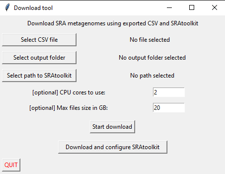

# Repository of the Download Tool for the MarMDB, HMgDB, and TMDB

The [Python scripts](#python-scripts) can be used on all operating systems. For Windows (Win10) we recommend the [Windows executable](#windows-executables) that are provided for easy use without the need to install Python or any dependencies.

## Compatibility to other metadata databases
The Download tool is compatible with exported CSV tables from the TerrestrialMetagenomeDB [Website](https://webapp.ufz.de/tmdb/) [Publication](https://academic.oup.com/nar/article/48/D1/D626/5625925) [PubMed](https://pubmed.ncbi.nlm.nih.gov/31728526/) and the HumanMetagenomeDB [Website](https://webapp.ufz.de/hmgdb/), [Publication](https://academic.oup.com/nar/article/49/D1/D743/5998395), [PubMed](https://pubmed.ncbi.nlm.nih.gov/33221926/). 

## Dependencies and Requirements

The scripts are written in Python3. The following Python Packages are necessary:

* tkinter
* os
* re
* platform
* urllib.request
* zipfile
* tarfile
* distro
 
The tkinter package has some system dependencies. You may install this package via `sudo apt-get install python3-tk` (on Ubuntu systems).

You may install the packages (except tkinter on Linux) via `pip install packageXY` or `pip3 install packageXY` (if you have Python2 installed and set as default). To install all at once:

```
pip install os re platform urllib.request zipfile tarfile distro
```

In addition, the [SRAtoolkit](https://github.com/ncbi/sra-tools) is required. If you have not installed it yet you may use our simple install and configuration script see [below](#sratoolkit-install-script)

## Download scripts
To download all scripts clone this repository:

```
git clone https://github.com/mdsufz/downloadtool.git
```

The download tool uses the [SRAtoolkit](https://github.com/ncbi/sra-tools) to download metagenome data. The [SRAtoolkit](https://github.com/ncbi/sra-tools) offers a very stable and fast download. If you have not installed the SRAtoolkit you can use our install and configuration script. 

### Graphical user interface (GUI)
We developed an east-to-use GUI to perform all relevant steps. Execute the `python download_gui.py` script to start the GUI. 



To install the SRAtoolkit via the GUI, click ***Download and configure SRAtoolkit*** button at the bottom. The download size is around 70MB. The procedure is completed once you get a notification.

To download metagenome samples, select the CSV export file from MarMDB, HMgDB, or TMDB, the desired output folder, and the location of your SRAtoolkit folder and start the download with the ***Start Download*** button. The [maximal file size](#maximal-file-size) and [CPU cores](cpu-cores) are optional input parameters. The parameters are explained below.


### Python scripts

All scripts are written in Python3, thus use `python3` instead of `python` to call the script if you have Python2 installed too and set as default. You may call the help to see required parameters (details explained below) via:

```
# Help call
python install_sra.py -h
python get_sra_sample.py -h
```

#### SRAtoolkit install script

If you have not installed the SRAtoolkit you can use our installation script. It performs the download and configuration of the SRAtoolkit for you. To run the installation script use: 

```
# SRAtoolkit install
python install_sra.py -p your/path/to/install`
```

#### Download script

The download script requires 3 mandatory and 2 optional parameters: 

* CSV path (`-c` or `--csv-path`): the path to the CSV export file from MarMDB, HMgDB or TMDB.
* output path (`-o` or `--out-path`): the path to the folder where all download and dumped metagenome data will be written.
* tool path (`-l` or `--tool-path`): the path to the folder where the SRAtoolkit was installed.
* [optional] [threads](#cpu-cores): `-t` or `--threads`
* [optional] [max file size](#maximal-file-size) `-m` or `--max-size`

The download script can be called via:

```
# Download SRA files and create FASTQ files
python get_sra_sample.py -c csv_path -o output_path -l sratoolkit_path -t 2 -m 20
```

### Windows executables

The Windows executables are compiled on Win10 64bit and can be used without the need to install Python and its dependencies on Windows.

The GUI can be started with a double click on the `download_gui.exe`. We apologize for the safety check question when starting this executable due to the missing Windows signature.

Instead of the GUI, you may want to use the command-line version of the single executables. Open the Windows terminal (`CMD`) navigate to the executable (`cd path_to_exe`) and use the parameters similar to the Python scripts:

The command-line executables can be used similarly to the [Python scripts](#python-scripts), the parameters are identical:

```
# SRAtoolkit install
install_sra.exe -p your/path/to/install

# Download SRA files and create FASTQ files
get_sra_sample.exe -c csv_path -o output_path -l sratoolkit_path -t 2 -m 20

```

### Optional parameters

#### Maximal file size
This parameter controls the maximal .sra file size that the SRAtoolkit will download. The file size is given in GB.

#### CPU cores
The SRAtoolkit can use multiple cores/threads to create the FASTQ files. More CPUs will speed up this process.

